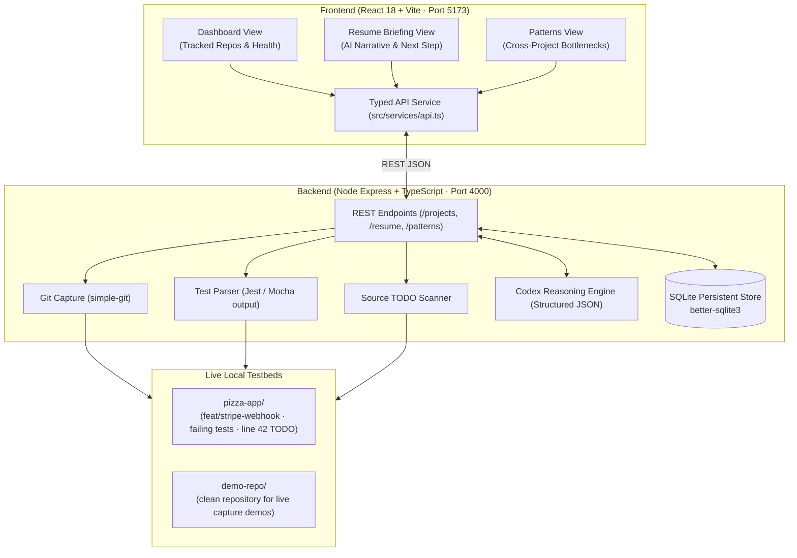

# ContextSwitch ⚡

> **Developer Context Recovery Engine**  
> *Turn 20 minutes of mental reconstruction into a 15-second resume briefing.*

[](https://openai.com)
[]()
[]()
[]()

---

## 🎯 Executive Summary & Problem

Software engineers spend up to **30% of their workday context switching** between microservices, client repositories, and unmerged feature branches. Every pause leaves behind a wake of half-remembered intentions:
- *What branch was I on?*
- *Why is this test suite failing?*
- *Which uncommitted file contains my in-flight work?*
- *What was the exact next step I intended to execute?*

Existing tools (stash managers, browser tabs, manual markdown notes) either provide **too much raw noise** (unfiltered `git diff` outputs) or **too little synthesis**.

**ContextSwitch** solves this through a 3-layer architecture:
1. **Deterministic Grounded Snapshot Capture:** Tracks uncommitted git diffs, failing test suites, and line-specific `// TODO:` comments across local repositories.
2. **Codex AI Reasoning Layer:** Synthesizes raw snapshot telemetry into a high-signal 3-sentence narrative, extracts the exact blocking test or TODO, and prescribes a **single copyable terminal command** to get back to flow.
3. **Cross-Project Pattern Intelligence:** Detects systemic bottlenecks across multi-repo workflows (e.g., recurring webhook HMAC serialization issues, missing Redis fixtures) to help teams eliminate recurring friction.

---

## 🏛️ System Architecture



---

## 🚀 Quickstart Guide

### Prerequisites
- **Node.js**: v18.0.0 or higher
- **npm**: v9.0.0 or higher
- **Git**: Installed and available on system path

### 1. Installation
Clone the repository and install dependencies for both frontend and backend:

```bash
# Install frontend dependencies
npm install

# Install backend dependencies
cd server
npm install
cd ..
```

### 2. Configuration
Copy the sample environment file in `server/`:

```bash
cp server/.env.example server/.env
```

| Variable | Description | Default |
|---|---|---|
| `PORT` | Backend Express API port | `4000` |
| `OPENAI_API_KEY` | Optional OpenAI key for Codex reasoning | *(Optional)* |
| `OPENAI_MODEL` | Codex / GPT reasoning model | `gpt-4o` |
| `DATABASE_PATH` | Path to SQLite database file | `./data/contextswitch.db` |

> 💡 **Demo-Safe Architecture:** If `OPENAI_API_KEY` is not provided, ContextSwitch automatically switches to a deterministic grounded reasoning fallback. This guarantees **100% demo safety on stage** with zero network dropouts or rate-limit failures.

### 3. Initialize Database
Seed the local SQLite database with realistic developer pause histories across 6 active services:

```bash
npm run seed
```

### 4. Start Development Servers
You can run the backend and frontend in separate terminals:

```bash
# Terminal 1: Start Backend (Port 4000)
npm run server

# Terminal 2: Start Frontend (Port 5173)
npm run dev
```

Open [http://localhost:5173](http://localhost:5173) in your browser.

> 📖 **Built-in Interactive Beginner Guide Tour:**
> When opening the web UI for the first time, an interactive modal automatically opens to walk users through the features, telemetry capture, and testing flow. You can also re-open it at any time by clicking **"Beginner Guide Tour"** in the top navigation bar.

---

## 💻 Testing with Your Own Local Repositories

ContextSwitch is **not limited to pre-configured demos** — you can point it at **any repository on your local machine**:

1. Click **"+ Track Local Repo"** on the Dashboard or in the Sidebar.
2. Choose one of two options:
   - **Preset 1-Click Track:** Track `ContextSwitch` itself (`.`) to see live git diffs, commits, and AST TODOs parsed immediately.
   - **Custom Local Repository Path:** Enter the path to any repository on your machine (e.g., `/Users/dev/projects/my-app` or `C:\dev\my-app`, or relative path `.` or `../my-project`).
3. Click **"Track & Run Initial Snapshot"**.
4. The local engine immediately inspects:
   - Git branch, HEAD commit message, and uncommitted diff stats (`+N / -N`).
   - Line-by-line `// TODO:` and `// FIXME:` comments parsed directly from source files.
   - Generates an instant, prioritized **Resume Briefing** with the exact next command to run.

---

## 📡 REST API Reference

The backend exposes a clean, typed REST API on port `4000`:

| Method | Endpoint | Description | Sample Response |
|---|---|---|---|
| `GET` | `/health` | Healthcheck & server uptime | `{"status":"ok","port":4000}` |
| `GET` | `/projects` | Get all tracked projects with latest status | `[{"id":"billing-service","name":"billing-service",...}]` |
| `GET` | `/snapshots/:projectId` | Full session timeline for a project | `{"projectId":"billing-service","timeline":[...]}` |
| `GET` | `/resume/:projectId` | Codex-generated resume briefing & next step | `{"briefing":{"summary":"...","nextStep":"..."}}` |
| `GET` | `/patterns` | Cross-project bottleneck themes & insights | `{"topPatterns":[...],"insight":"..."}` |
| `POST` | `/snapshot/:projectId` | Trigger instant git/test/TODO capture | `{"success":true,"snapshot":{...}}` |
| `DELETE` | `/projects/:projectId` | Untrack a project and delete snapshots | `{"success":true}` |

---

## 🎨 Design System & Aesthetics

ContextSwitch rejects generic SaaS dark modes and low-contrast AI gradients in favor of an **editorial, human-centric design system**:

- **Warm Ivory Canvas (`#FFF8ED`):** High-legibility, warm background inspired by physical notebooks and print typography.
- **Pure Terracotta Accent (`#F2542D`):** Strictly reserved for the single most important action per view (**Suggested Next Step**).
- **Hairline Micro-Borders (`#EDE0CC`):** Crisp structural division without heavy box shadows.
- **Dual Typography:**
  - **Inter:** UI labels, narratives, descriptions, and headings.
  - **JetBrains Mono:** Code paths, git branches, diff stats (`+42/-3`), and copyable terminal commands.
- **1-Click Command Copying:** Interactive code callouts with instant clipboard copy and visual toast feedback.

---

## 📦 Project Directory Structure

```text
ContextSwitch/
├── docs/                         # Project documentation
│   └── demo-script.md            # Walkthrough and demonstration pitch script
├── server/                       # Backend Application (Node + Express + TS)
│   ├── .env.example              # Environment variables template
│   ├── package.json              # Backend scripts & dependencies
│   ├── tsconfig.json             # Backend TypeScript configuration
│   ├── data/
│   │   └── contextswitch.db      # SQLite persistent snapshot database
│   └── src/
│       ├── server.ts             # Express server setup (Port 4000)
│       ├── types.ts              # Backend data contracts
│       ├── db/                   # SQLite connection & database initialization
│       ├── engine/               # Git telemetry, test parser, & AST TODO scanner
│       ├── reasoning/            # OpenAI Codex / GPT-4o reasoning
│       └── routes/               # Typed REST API route handlers
├── src/                          # Frontend Application (React 18 + TS)
│   ├── App.tsx                   # Live state coordinator & routing
│   ├── main.tsx                  # React DOM entrypoint
│   ├── index.css                 # Custom design tokens & base styling
│   ├── components/               # Modular UI architecture
│   │   ├── layout/               # Sidebar & TopBar components
│   │   ├── dashboard/            # Project cards & search filters
│   │   ├── briefing/             # Resume Briefing & Next Step callouts
│   │   ├── patterns/             # Cross-project bottleneck analytics
│   │   └── common/               # Modals, toasts, badges, skeletons
│   ├── services/                 # Typed REST client
│   └── types/                    # Shared TypeScript interfaces
├── .gitignore                    # Git exclusions
├── README.md                     # Root Project Documentation (You are here)
├── package.json                  # Root scripts (dev, build, server, seed)
├── tsconfig.json                 # TypeScript project configuration
└── vite.config.ts                # Vite frontend bundler configuration
```

---

## 🎤 Presentation & Demo Guide

For the presentation and live demonstration walkthrough, refer to:

👉 **[docs/demo-script.md](file:///c:/Users/dell/OneDrive/Desktop/ContextSwitch/docs/demo-script.md)**

Includes:
- **Exact 3-Minute Presentation Flow** with time-stamped visual cues.
- **Narrative Hook:** The real cost of multi-tasking and cognitive overload.
- **Live Action Choreography:** From paused terminal state to the instant 15-second resume briefing.
- **Technical Defense Sheet:** Answers to questions on privacy, token efficiency, IDE extensions, and capture overhead.

---

## 👥 Acknowledgments

Built with **OpenAI Codex Reasoning**, **React 18**, **Node Express**, **SQLite**, and **Antigravity**.

