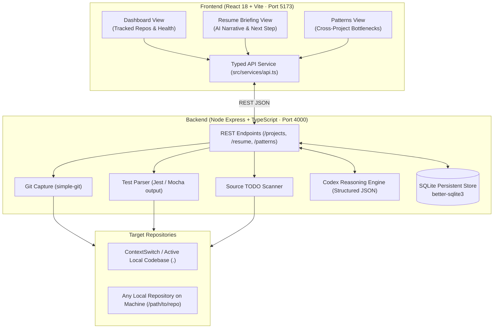
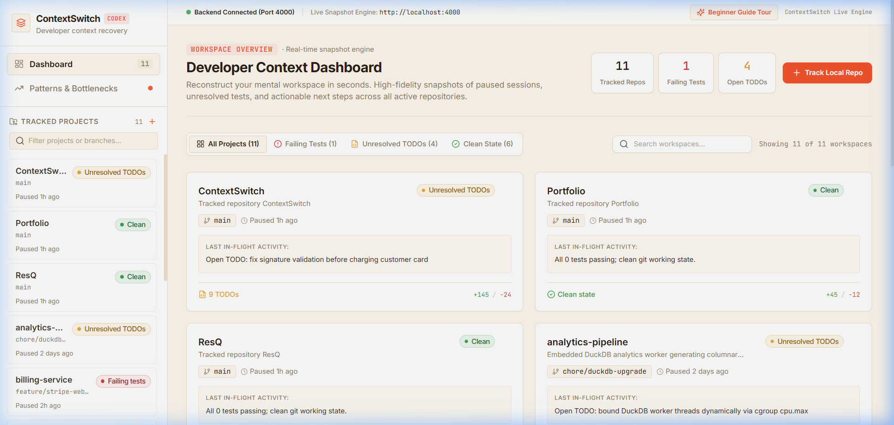
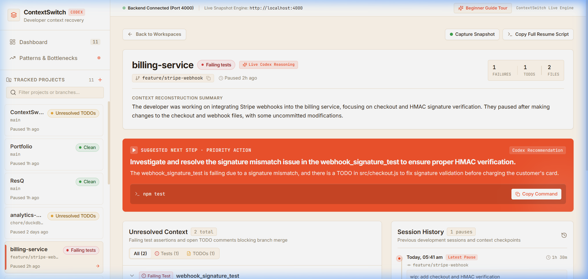
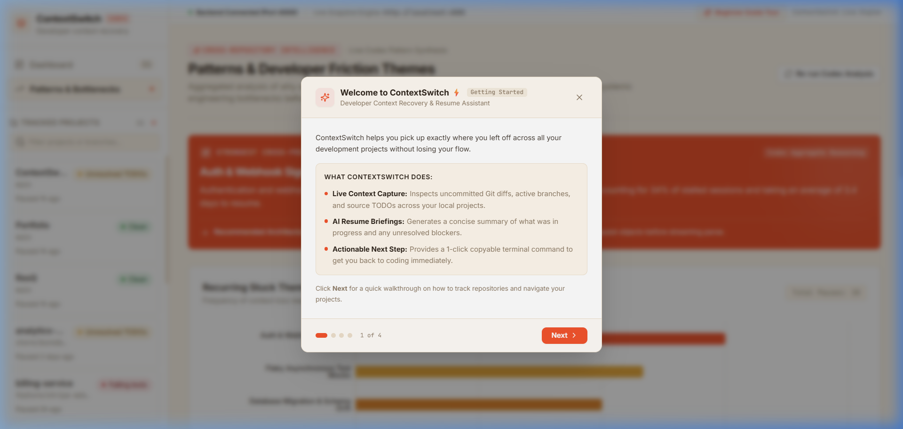
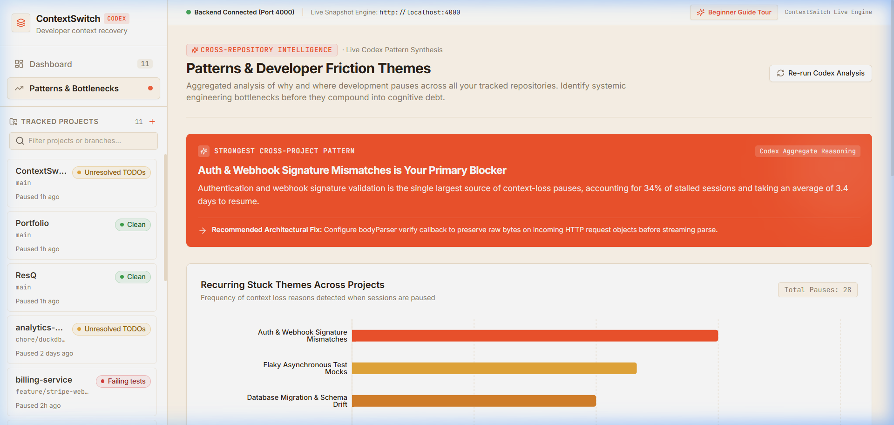
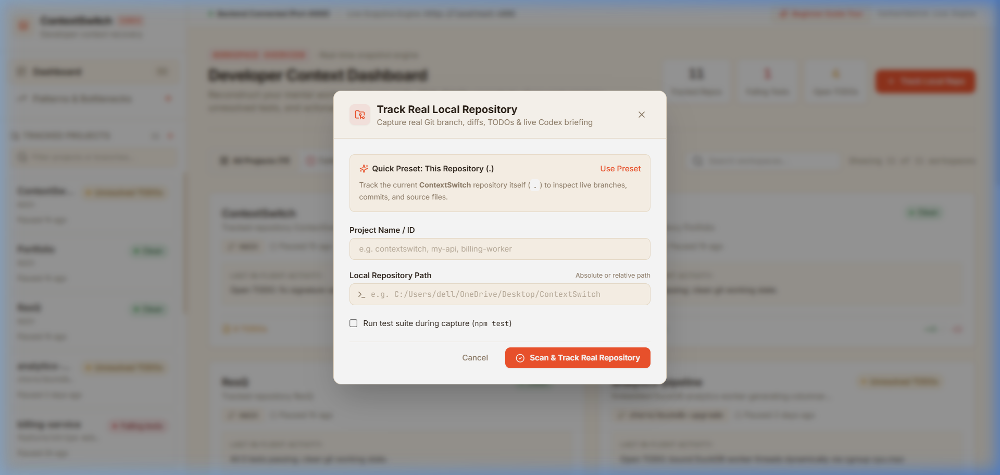

# ContextSwitch ⚡

> **Developer Context Recovery Engine**  
> *Turn 20 minutes of mental reconstruction into a 15-second resume briefing.*

---

## Overview

**ContextSwitch** is an agentic developer productivity tool designed to eliminate the friction of switching between multiple repositories, branches, and projects. Whenever a developer returns to a paused project, ContextSwitch inspects uncommitted Git diffs, active branches, failing test suites, and source code `// TODO:` comments to automatically synthesize a concise **15-second resume briefing** and prescribe a **single 1-click copyable terminal command** to immediately return to flow.

---

## Problem Statement

Software engineers switch contexts multiple times a day—interrupted by meetings, urgent bug fixes, pull request reviews, or multi-repo microservice dependencies. 

Every time a developer pauses and returns to a project, they spend **20 to 30 minutes reconstructing their mental cache**:
* *Which branch was I working on?*
* *What was the exact bug I was in the middle of fixing?*
* *Why is the test suite failing?*
* *Which file contains my half-finished changes?*
* *What was the very next terminal command I intended to run?*

Existing tools (manual markdown notes, git stashes, or raw `git diff` outputs) either require high manual overhead or produce overwhelming noise without actionable synthesis.

---

## Solution

ContextSwitch solves cognitive reorientation through a 3-layer architecture:

1. **Deterministic Grounded Snapshot Capture:** Direct local telemetry via `simple-git`, test execution parsers, and source AST regex scanners that extract the factual state of any local repository without manual logging.
2. **Codex AI Reasoning Layer:** Synthesizes raw in-flight telemetry into a human-readable 3-sentence narrative, identifies unresolved blockers, and prescribes a **single copyable terminal command** to resume work.
3. **Cross-Project Pattern Intelligence:** Clusters recurring development bottlenecks across multiple services (e.g., repeated webhook HMAC signature failures or database pool leaks) to help engineers identify systemic friction.

---

## 🏛️ System Architecture



---

## Features

* **Instant 15-Second Resume Briefing:** Plain-English summary of what was in-flight, which files were touched, and what needs immediate attention.
* **Suggested Next Step (Terracotta Callout):** Generates the single highest-priority terminal command with 1-click clipboard copying.
* **Real Local Repository Tracking:** Point ContextSwitch to any local repository folder on your machine or track the active project (`.`) in 1 click.
* **Unresolved Blockers Detection:** Parses failing test assertions and pinpoints source code `// TODO:` and `// FIXME:` comments down to the exact file and line number.
* **Historical Session Timeline:** Automatically logs session snapshots to SQLite, creating an auditable timeline of project progress.
* **Cross-Project Pattern Analytics:** Aggregates recurring patterns, affected repositories, and provides AI recommendations.
* **Zero-Config Offline Resilience:** If an OpenAI API key is unavailable or the network drops, a built-in deterministic heuristic engine generates briefings without crashing or failing.
* **Interactive Beginner Guide Tour:** A guided 4-step walkthrough modal that welcomes new users and explains the core workflows.
* **Human-Centric Editorial Design System:** Warm ivory canvas (`#FFF8ED`), high-contrast typography, and terracotta accenting tailored for maximum developer focus.

---

## Tech Stack

* *Frontend:* React 18, TypeScript, Vite, Tailwind CSS, Lucide Icons
* *Backend:* Node.js, Express, TypeScript, simple-git
* *Database:* SQLite via `better-sqlite3` (WAL mode enabled)
* *APIs / Services:* OpenAI API (`gpt-4o` with structured JSON schema output)
* *Hosting / Deployment:* Local full-stack execution (`localhost:5173` & `localhost:4000`)
* *Other Tools:* Antigravity AI pair programming assistant

---

## Codex / OpenAI Usage

During the development of ContextSwitch, OpenAI Codex and GPT-4o were utilized across the entire lifecycle:

* **Ideation & Problem Framing:** Refined the core value proposition of "context recovery" vs. traditional task managers, identifying developer reorientation time as the key metric to optimize.
* **Architecture Planning:** Designed the 3-layer architecture separating deterministic local telemetry collection from non-deterministic LLM synthesis.
* **Code Generation:** Accelerated full-stack TypeScript implementation, including the typed REST API endpoints, AST comment scanners, and React dashboard components.
* **API Integration & Prompt Engineering:** Formulated strict system prompts utilizing OpenAI's structured outputs (`response_format: { type: "json_object" }`) to guarantee type-safe JSON for resume briefings and cross-project pattern extraction.
* **Debugging & Edge-Case Handling:** Implemented cross-platform path resolution across Windows, macOS, and Linux, and developed the offline fallback heuristic engine.
* **UI/UX Development:** Styled the editorial warm ivory aesthetic and built interactive components like 1-click command callouts and the interactive Beginner Guide Tour.

---

## Demo

### Live Demo

* Run locally on your machine via: [http://localhost:5173](http://localhost:5173)

### Demo / Pitch Video

* [Demo / Pitch Video Link - To be added]
* **Presentation Script:** Refer to [`docs/demo-script.md`](file:///c:/Users/dell/OneDrive/Desktop/ContextSwitch/docs/demo-script.md) for the complete 3-minute live pitch flow with time-stamped cues.

---

## Screenshots

### 1. Dashboard View
Overview of all tracked local microservices with live health status pills, active branches, last pause timestamps, failing tests, open TODO counts, and the real-time backend engine connection status.



---

### 2. Resume Briefing & Suggested Next Step
Upon selecting any project, ContextSwitch synthesizes recent Git diffs and AST TODOs into a 15-second resume briefing and prescribes the exact copyable terminal command needed to resume coding.



---

### 3. Interactive Beginner Guide Tour
A clean, 4-step guided walkthrough modal that automatically introduces new users and judges to local repository tracking, telemetry capture, and the 1-click preset.



---

### 4. Cross-Project Pattern Intelligence
Aggregates recurring friction points and architectural bottlenecks across microservice repositories with actionable AI recommendations.



---

### 5. Track Real Local Repository
Allows developers and evaluators to point ContextSwitch at **any active Git repository on their local machine** without needing cloud setup or simulated mocks.

* **1-Click Active Codebase Preset (`.`):** Click "Use Preset" to automatically track the current repository (`ContextSwitch` itself), instantly parsing live uncommitted diffs, active branches, and recent commits.
* **Custom Local Path Input:** Accepts any relative or absolute folder path across Windows, macOS, and Linux (e.g. `.` or `../my-project` or `/Users/dev/code/api`).
* **Instant Snapshot & Source AST Scan:** Directly invokes local `simple-git`, detects uncommitted additions/deletions, extracts line-specific `// TODO:` and `// FIXME:` source anchors, and generates a fresh AI resume briefing in under 2 seconds.



---

## How to Run Locally

```bash
# 1. Clone the repository
git clone https://github.com/lakshmianoopoff/ContextSwitch.git
cd ContextSwitch

# 2. Install frontend and backend dependencies
npm install
cd server
npm install
cd ..

# 3. (Optional) Configure OpenAI API Key
# Copy the sample environment file in server/
cp server/.env.example server/.env
# Edit server/.env and add your OPENAI_API_KEY (ContextSwitch also works 100% offline without a key)

# 4. Start the development servers
# Terminal 1: Start Backend Engine (Port 4000)
npm run server

# Terminal 2: Start Frontend Application (Port 5173)
npm run dev
```

Open [http://localhost:5173](http://localhost:5173) in your browser.

---

## Additional Notes

* **Works with Any Local Git Repository:** You can track any repository on your computer by clicking **"+ Track Local Repo"** in the top navigation bar or sidebar and entering the folder path (or using the `.` preset for ContextSwitch itself).
* **Zero-Config & Offline Safe:** An OpenAI API key is optional. If not configured, ContextSwitch automatically activates its local heuristic reasoning algorithm, ensuring that evaluations and live demos never crash or fail due to network drops.
* **SQLite Persistence:** All session snapshots and tracked projects persist locally in `server/data/contextswitch.db`.
